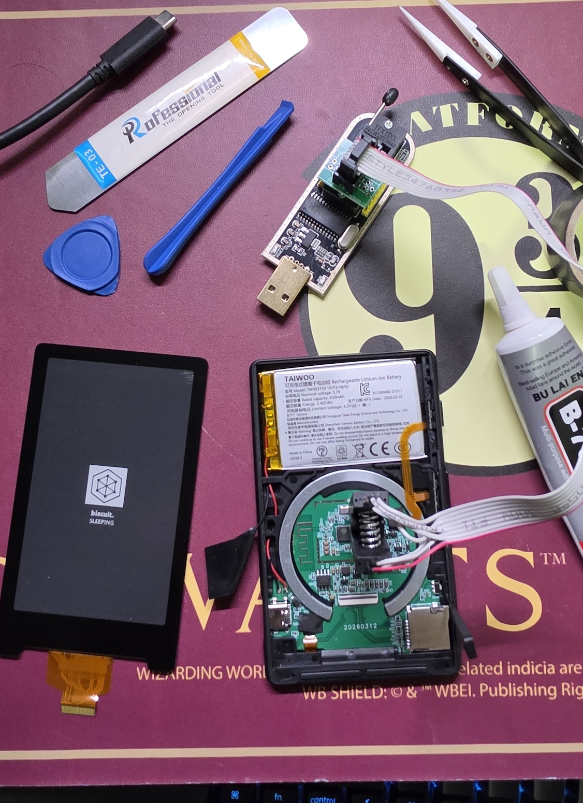

# Biscuit

09/09/2026 - version `0.1.0-thai-media-ota15`
Forked from [yattsu/biscuit](https://github.com/yattsu/biscuit). All core reading functionality comes from Biscuit.

## Features

- [Added] Read Thai-language EPUBs with the PK Nakhon Sawan font
- [Added] Open BMP, JPG/JPEG, and PNG files from the File Browser
- [Added] `Tools > Image Viewer` for browsing only BMP, JPG/JPEG, and PNG files on the MicroSD
- [Added] Supports entering subfolders, with images in each folder sorted using natural sort order
- [Added] `Home > Tools > ID Card` for viewing ID card information. Configuration is stored at `/biscuit/id_card.txt` as UTF-8 plain text. See the format below.
- [Fixed] Update firmware via `/update.bin` at the root of the MicroSD
- [Fixed] Send `update.bin` to the MicroSD through the File Transfer page over the network
- [Fixed] Improved File Transfer stability: disables Wi-Fi sleep, enables auto-reconnect, and waits for the connection to recover from brief drops before leaving the page
- [Fixed] No screen refresh while reading `update.bin` from the MicroSD
- [Fixed] for Thai book/chapter titles in the status bar

⚠️ **Note:** After installing Biscuit, I found that my device could no longer be updated due to a USB Lock (burnt eFuse).
The link below worked for me to update the firmware again: [Fix Bricked Xteink](https://github.com/paulporto/crosspoint-reader/blob/develop/docs/fix-bricked-xteink.md)



```bash
~$ sudo flashrom --programmer ch341a_spi -r backup_0.bin
    [...]
    Reading flash... done.
~$ sudo flashrom --programmer ch341a_spi -r backup_1.bin
    [...]
    Reading flash... done.
    # lets compare the hashes from the back ups
~$ md5sum backup_0.bin
    211522e56616ea46ac9bcf82d3451eb2  backup_0.bin
~$ md5sum backup_1.bin
    211522e56616ea46ac9bcf82d3451eb2  backup_1.bin
~$ sudo flashrom --programmer ch341a_spi -w crosspoint_backup.bin
    [...]
    Reading old flash chip contents... done.
    Erasing and writing flash chip... Erase/write done.
    Verifying flash... VERIFIED.
```

Backup file [crosspoint_backup.bin](./docs/crosspoint_spiflash_backup.tar.xz)

After installing `crosspoint_backup.bin`, simply drag and drop the custom firmware file onto the root of the SD card, rename it to `update.bin`, then insert the SD card into the XTeink and hold **Power + Vol Up** until it boots into firmware upgrade mode


## Generating Images from PDF

The `pdf_to_img_x4.py` script accepts multiple PDF files, splits each page into 4 parts in manga reading order, and generates 480x800 BMP images:

```bash
python pdf_to_img_x4.py volume1.pdf volume2.pdf -o output
```

Copy the resulting folder to the MicroSD, open the first image, then use the Page Forward / Page Back buttons to continue reading seamlessly.


## Example config อยู่ใน `id_card.txt`

```text
# Biscuit ID Card (UTF-8)
first_name=John
last_name=Doe
phone=081-234-5678
email=johnd1@example.com
company=Example
company_id=AX12345
company_email=john.d@example.com
company_position=Engineer
department=Data
photo=/biscuit/id_photo.bmp
```

### Portrait Photo

The simplest way is to place the photo in one of the following locations:

1. `/biscuit/id_photo.bmp`
2. `/biscuit/id_photo.jpg`
3. `/biscuit/id_photo.jpeg`
4. `/biscuit/id_photo.png`

The system searches in the order listed above, or you can specify a custom path with the `photo=/path/to/photo.jpg` line in the config. BMP, JPG/JPEG, and PNG are supported, and JPG/PNG files are converted to a BMP cache on the MicroSD before rendering.

A portrait-orientation photo is recommended, with an aspect ratio of approximately `9:11` or `180x220` pixels. If the photo is larger, it will be scaled down to fit the frame; the original file is not modified.
